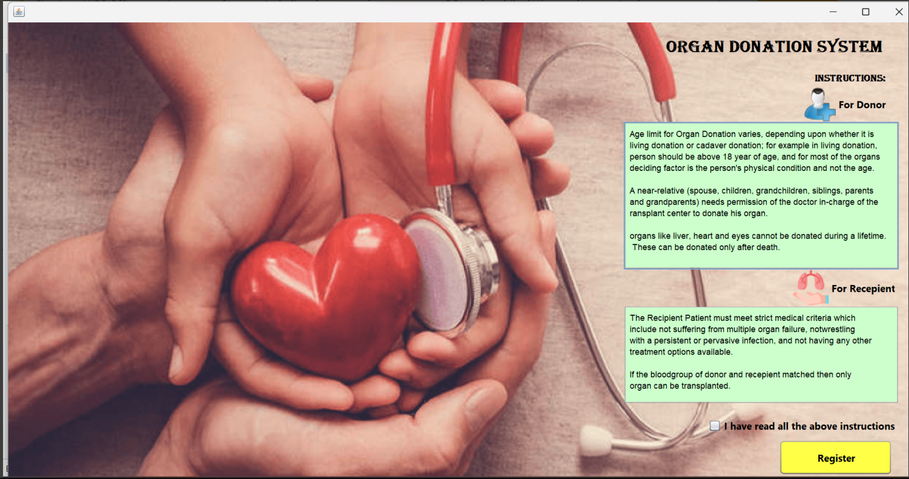
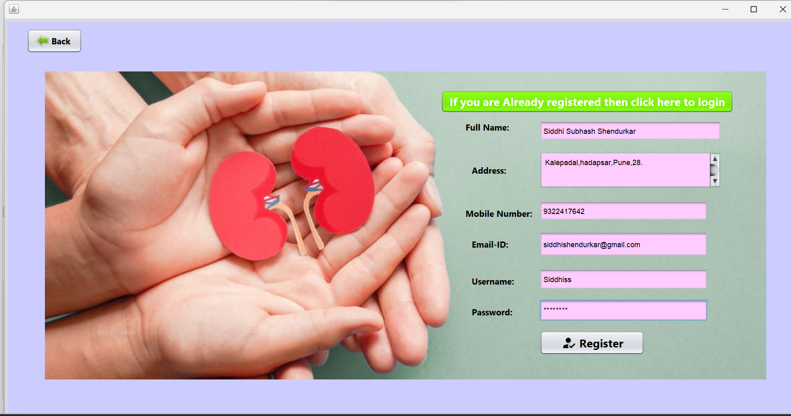
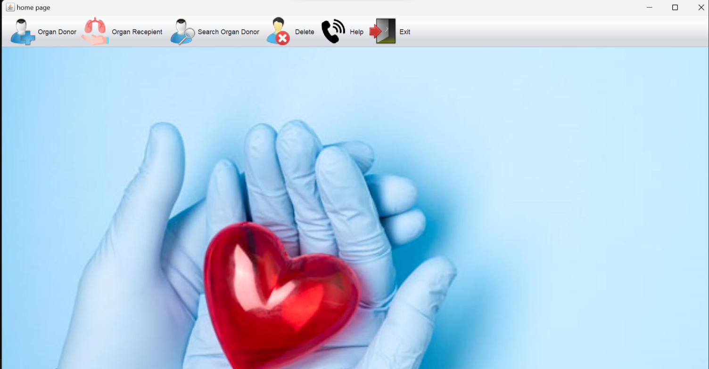
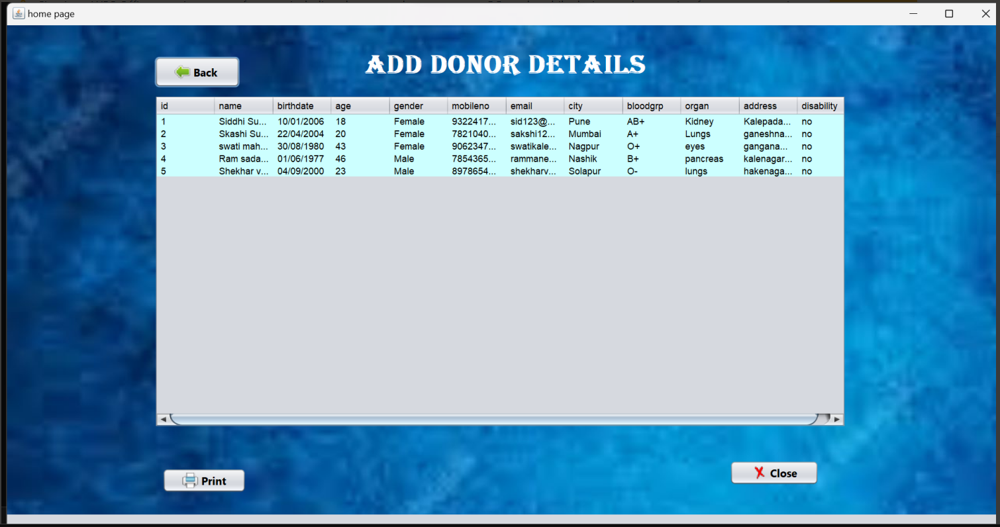
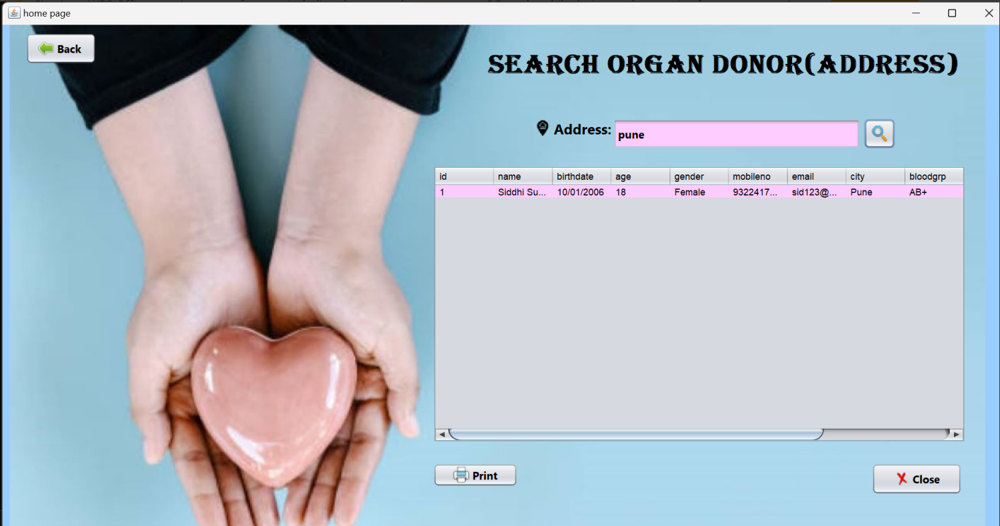

# Organ-Donation-System
Java-based desktop application developed using Swing components to manage the process of organ donation efficiently. It facilitates the registration of organ donors, helps match donors with recipients, and provides hospitals and organizations with a structured system.

# Features

- Register organ donors and recipients
- Match donors with compatible recipients
- Maintain donor and recipient database
- Search functionality for efficient record filtering
- Secure login system

# Tech Stack

- **Language:** Java  
- **GUI Framework:** Swing  
- **Database:** MySQL  
- **IDE Used:** NetBeans

# Screenshots

# Prerequisites
- Java JDK 8 or later
- MySQL Server
- IDE like NetBeans / IntelliJ
- MySQL JDBC Driver

# Author 
Siddhi2006

# Contact
If you have any queries or suggestions, feel free to connect:
Email: siddhishendurkar@gmail.com

LinkedIn: www.linkedin.com/in/siddhi-shendurkar

